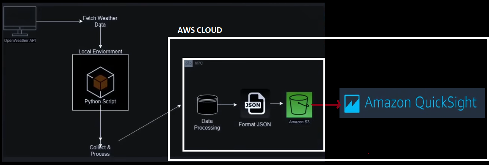
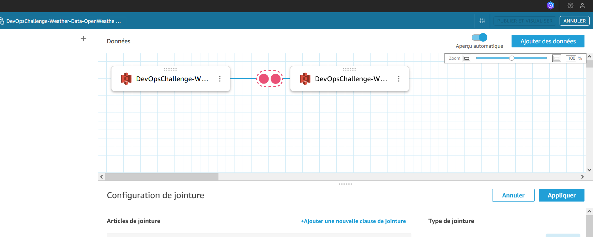
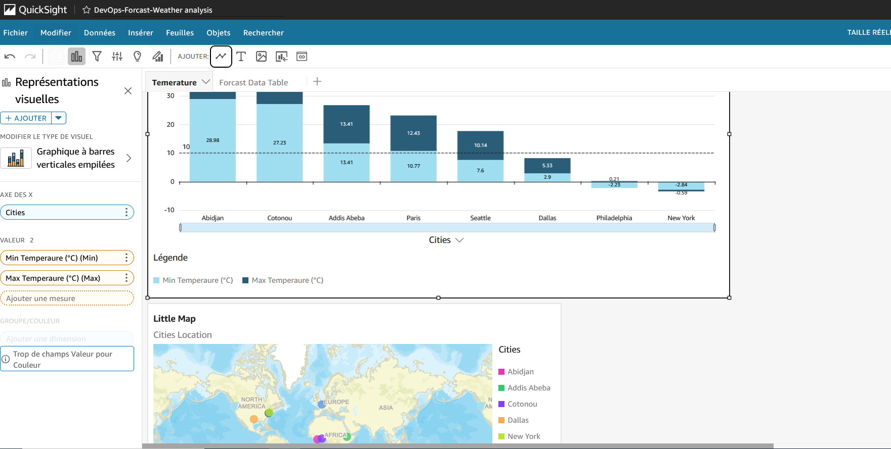
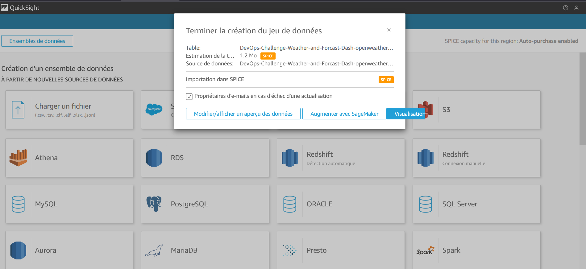

# 30 Days DevOps Challenge - Weather Data Collection System - DevOps Day 1 Challenge
# Journée 1: Création d'un système de collecte de données météorologiques à l'aide d'AWS S3 et de l'API OpenWeather

## Aperçu du projet
Ce projet est un système de collecte de données météorologiques qui démontre les principes fondamentaux de DevOps en combinant :
- Intégration d'API externes (API OpenWeather)
- Stockage dans le cloud (AWS S3)
- Infrastructure en tant que code
- Contrôle de version (Git)
- Développement Python
- Gestion des erreurs
- Gestion de l'environnement
- Tests automatisés avec Python VS Code debugger extension

 

## Fonctionnalités du projet
- Récupère les données météorologiques en temps réel pour plusieurs villes
- Affiche la température (°C), l'humidité et les conditions météorologiques
- Stocke automatiquement les données météorologiques dans AWS S3
- Prend en charge le suivi de plusieurs villes
- Horodatage de toutes les données pour un suivi historique
- Intégration de prévisions météorologiques
- Visualisation des données données météo de 7 villes Avec AWS QuickSight 
- Pipeline CI/CD avec GitHub Actions
   


 



## Architecture technique
-  Python 3.x
-   AWS (S3)
- **External API:** OpenWeather API
- **Dependencies:** 
  - boto3 (AWS SDK)
  - python-dotenv
  - requests

```markdown
## Structure du projet
weather-dashboard/
  src/
    __init__.py
    weather_dashboard.py
    quick_sight_manifest_forcast.json
    quick_sight_manifest_weather.json
    quick_sight_manifest.json
    img/

  tests/
  data/
  .env
  .gitignore
  requirements.txt

## Instructions de configuration
1. Clone the repository:
--bash
git clone https://github.com/sekedoua/30days-weather-dashboard.git

3. Installation des dépendances:
--bash
pip install -r requirements.txt

4. Configuration des variable d'environnement fichier ( fichier .env):
OPENWEATHER_API_KEY="votre_cle_API"
AWS_BUCKET_NAME="nom_de_votre_compartiment_S3"

4.Configuration  des accès AWS :
--bash 
aws configure

5. Lancer l'application :
python src/weather_dashboard.py

## Ce que j'ai appris

Création et gestion de buckets/compartiments AWS S3
Gestion des variables d'environnement pour des clés API sécurisées
Bonnes pratiques Python pour l'intégration d'API
Flux de travail Git pour le développement de projets
Gestion des erreurs dans les systèmes distribués
Gestion des ressources cloud


